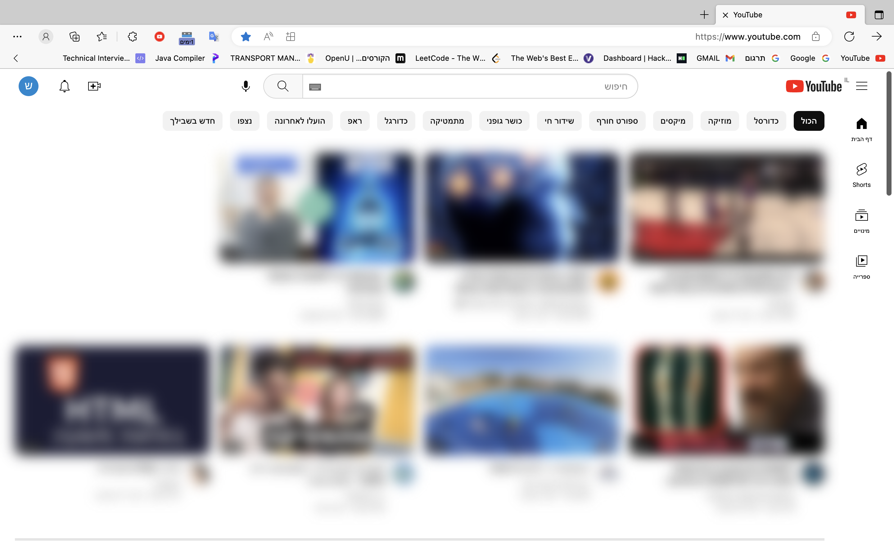

# Youtube - blur suggested video

Designed for people who work/study during the day with YouTube and want to focus on their tasks.

When the extansion is working, it prevent from user to see the suggested video and also to clicking on them.

User's have **switch to on/off** the extansion every moment.

## Screenshots

## Installation

* Download ZIP file from Github (code->"Download Zip")
* Extract ZIP in your computer to folder
* Open chrome://extensions/ in browser (edge/safari...)
* Click on the load unpacked button
* Select the "extract folder" (youtube-blur-suggestion-videos)

and... Done ! hope you like it

